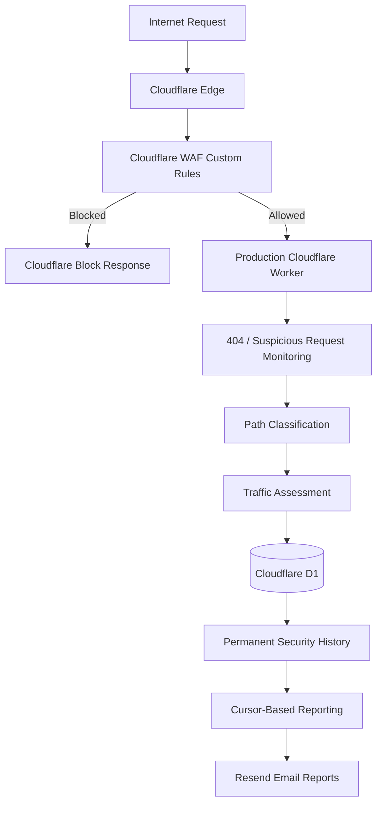
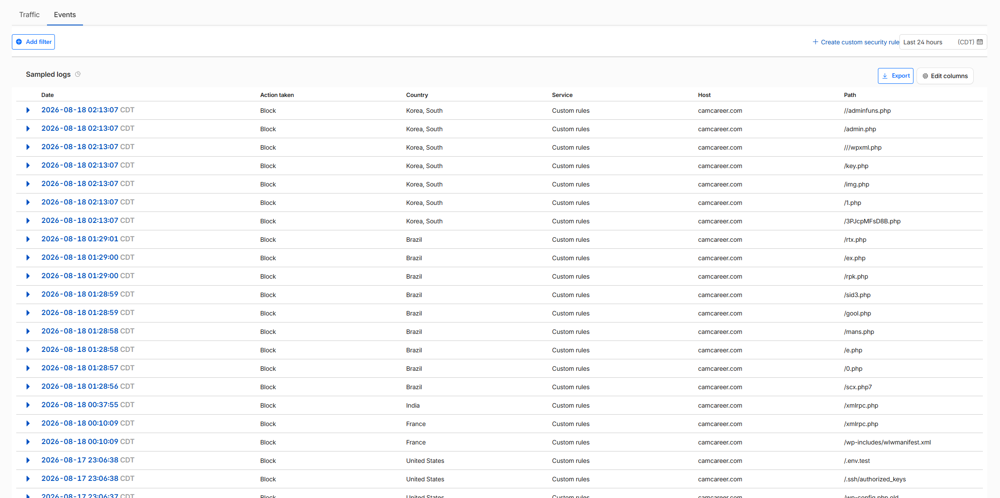
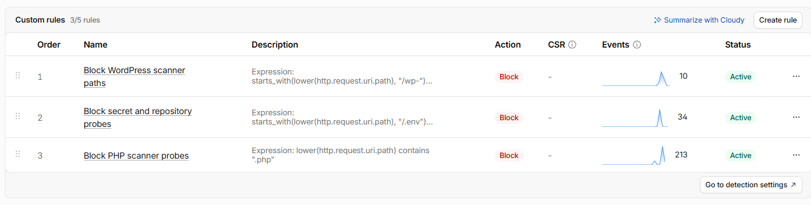
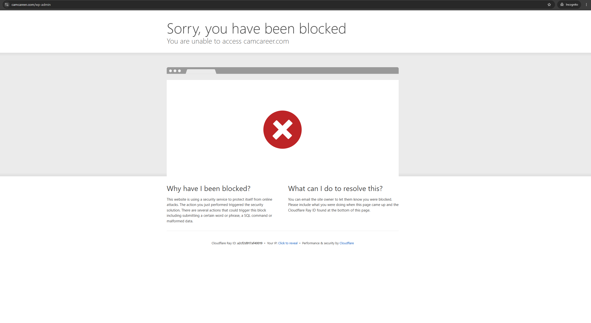
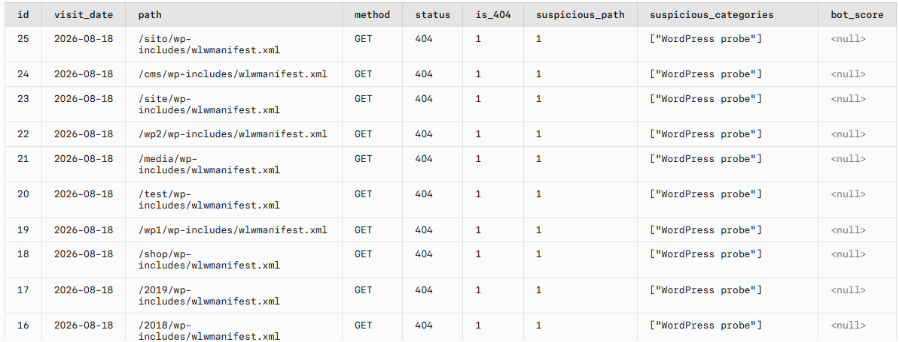

# Web Security Monitoring & WAF System 🛡️

## Overview

This project documents the security monitoring and mitigation system protecting my production portfolio website, [CamCareer](https://camcareer.com).

The system combines **Cloudflare WAF custom rules** with a **Cloudflare Worker-based monitoring and detection layer** to identify, classify, log, and report suspicious HTTP activity.

It was developed in response to real automated scanning observed against the live website, including probes for WordPress files, PHP endpoints, environment files, repository metadata, credentials, and other resources that do not belong to the static site.

> This security functionality operates inside the same production Cloudflare Worker used by my separate [Cloudflare Visitor Reporting System](https://github.com/CamLee27/cloudflare-visitor-reporting-system). This repository focuses specifically on the security monitoring, detection, classification, D1 logging, reporting, and WAF components.

## Key Features

* Cloudflare WAF custom blocking rules
* Server-side 404 and suspicious-request monitoring
* Suspicious-path classification
* Bot/scanner traffic assessment
* Cloudflare bot-management signal integration
* Permanent Cloudflare D1 security history
* Cursor-based incremental reporting
* Automated security reports every four hours
* Manual administrative report triggering
* Analysis of real production scanner traffic
* Sanitized public code and evidence

## Security Architecture



The security design uses two separate layers:

**Cloudflare WAF custom rules** provide mitigation for clearly inappropriate requests.

**The Cloudflare Worker** provides monitoring, classification, logging, and reporting for security-relevant activity that reaches the application.

## Real-World Security Monitoring

Cloudflare Security Analytics showed real automated scanners probing the production domain.

Observed traffic included requests for:

* WordPress administration and configuration files
* Random PHP endpoints
* Environment files
* Repository metadata
* Credential and key-related paths
* Framework and development files

These observations were used to create targeted WAF protections rather than applying an arbitrary aggressive global rate limit.

### Real Blocked Scanner Traffic



The screenshot above shows real requests blocked by Cloudflare custom security rules across multiple scanner paths.

## Cloudflare WAF

Three primary custom-rule categories are currently used.

### WordPress Scanner Paths

CamCareer does not use WordPress, so requests for WordPress-specific resources can be blocked.

Examples include:

```text
/wp-admin
/wp-login.php
/wp-config.php
/xmlrpc.php
```

### Secret and Repository Probes

Requests targeting sensitive configuration, credential, and repository resources are blocked.

Examples include:

```text
/.env
/.git/config
/.aws/credentials
/.ssh/
```

### PHP Scanner Probes

CamCareer is a static site and does not use PHP.

Requests for `.php` resources therefore do not represent valid application functionality and can be blocked.

### Active WAF Rules



The WAF rules were created based on actual traffic patterns observed against the production site.

### Verified Blocking



This test confirms that a request for a WordPress administration path is blocked at the Cloudflare layer while the normal website remains accessible.

## Server-Side Security Monitoring

Automated scanners frequently do not execute frontend JavaScript.

For that reason, security monitoring is performed server-side inside the Cloudflare Worker.

The Worker records security-relevant requests when:

* The response is an HTTP `404`
* The requested path matches a suspicious-path category

It intentionally does **not** store every image, CSS, JavaScript, or other static asset request.

This keeps the security data focused and reduces unnecessary database activity.

## Suspicious Request Detection

The production system recognizes several categories of suspicious paths, including:

```text
Environment / secret file probes
Version-control metadata probes
WordPress probes
PHP probes
Administrative-panel probes
Server / CGI probes
Framework / dependency probes
Credential / key-file probes
Configuration-file probes
Development-file probes
```

The public source includes representative examples without publishing the complete production rule library.

## Bot / Scanner Classification

Traffic classification is heuristic and intentionally conservative.

The system uses three labels:

```text
Likely Human
Uncertain
Likely Bot / Scanner
```

Confidence is reported as:

```text
Low
Medium
High
```

The production system combines multiple signals, which can include:

* Cloudflare bot-management signals
* Suspicious-path activity
* Repeated 404 behavior
* Request timing patterns
* Reported browser/user-agent information
* Hosting, cloud, VPN, or proxy network context
* Normal page activity
* Intentional navigation behavior

A single weak signal is not treated as proof that a visitor is automated.

> **Likely Bot / Scanner does not automatically mean malicious.**

Traffic classification and WAF blocking are separate decisions.

Some exact production thresholds and detection logic are intentionally omitted from the public repository.

## Cloudflare D1 Security Logging

Security events are stored permanently in Cloudflare D1.

Database binding:

```text
SECURITY_DB
```

The main security table is:

```text
request_observations
```

It records fields such as:

* Timestamp
* Request path
* HTTP method
* Response status
* 404 status
* Suspicious-path status
* Suspicious categories
* Selected Cloudflare request metadata
* Bot-management signals when available

The public SQL schema is available here:

**[View the D1 Security Schema](./sql/d1-security-schema.sql)**

### Sanitized D1 Security Records



The screenshot shows real suspicious requests stored in D1 while excluding visitor IP addresses and other private information.

## Workers KV to D1 Migration

The system originally used Cloudflare Workers KV.

As real scanner traffic increased, the security-monitoring workload generated significantly more KV write and delete activity than the original visitor-reporting design.

The architecture was migrated to **Cloudflare D1** instead.

### Previous Design

```text
Security Event
      ↓
Workers KV
      ↓
Email Report
      ↓
Record Cleanup
```

### Current Design

```text
Security Event
      ↓
Permanent D1 Row
      ↓
Report Reads New Rows
      ↓
Email Successfully Sent
      ↓
Report Cursor Advances
      ↓
Original Row Remains Stored
```

This preserves the historical security data instead of deleting it after each report.

More details:

**[Workers KV to D1 Migration](./docs/kv-to-d1-migration.md)**

## Cursor-Based Reporting

The reporting system uses saved D1 cursors to identify records that have not yet been reported.

After an email is successfully accepted:

1. The relevant report cursor advances.
2. Previously reported rows are not included again.
3. The underlying security records remain permanently stored.

This separates:

```text
Data retention
```

from:

```text
Report delivery state
```

Automated reports run every four hours, with an additional authenticated manual report option for administrative testing.

## Production Worker Cleanup

The integrated production Worker had grown to approximately **5,416 lines** after many incremental updates.

It was reviewed and rebuilt into a cleaner D1-only implementation of approximately **1,795 lines**.

The cleanup removed obsolete KV logic, duplicated conditions, unused helpers, legacy storage behavior, and other unnecessary code.

The public repository does **not** contain the entire production Worker.

Instead, it contains a curated security-focused extract:

**[View the Public Security Monitoring Code](./src/security-monitoring-worker.js)**

This keeps the repository useful for demonstrating the implementation without publishing every production detection rule, threshold, administrative workflow, or unrelated visitor-analytics component.

## Project Separation

The production system contains both security and visitor-reporting functionality in one Cloudflare Worker.

For portfolio purposes, they are documented as separate projects because they solve different problems.

| Project                                                                                                    | Focus                                                                                       |
| ---------------------------------------------------------------------------------------------------------- | ------------------------------------------------------------------------------------------- |
| **Web Security Monitoring & WAF System**                                                                   | WAF, suspicious-request detection, scanner classification, security logging, and mitigation |
| **[Cloudflare Visitor Reporting System](https://github.com/CamLee27/cloudflare-visitor-reporting-system)** | Page views, intentional navigation, visitor analytics, and automated reporting              |

There are not two separate production Workers.

## Verified Functionality

The following have been tested successfully:

* Production site continues to load normally
* Security-relevant 404 requests are stored in D1
* Suspicious paths are identified and categorized
* Security records remain stored after reporting
* Report cursors prevent old records from being repeatedly emailed
* Automated reports operate on the four-hour schedule
* Manual report triggering works
* WordPress scanner paths are blocked
* Environment-file probes are blocked
* PHP scanner probes are blocked
* Normal site functionality remains available after WAF deployment
* The previous KV Worker binding has been removed

## Security and Privacy

Production security records can contain sensitive visitor information.

This public repository intentionally excludes:

```text
API keys
Administrative tokens
Personal email addresses
Real visitor IP addresses
Visitor location information
Visitor ISP / network information
Cloudflare account identifiers
Cloudflare zone identifiers
AWS credentials
```

Screenshots and source files included in this repository are sanitized before publication.

## Technologies

| Technology                    | Use                                                   |
| ----------------------------- | ----------------------------------------------------- |
| Cloudflare WAF                | Blocking clearly inappropriate scanner requests       |
| Cloudflare Workers            | Server-side monitoring, classification, and reporting |
| Cloudflare D1                 | Permanent security-event storage                      |
| JavaScript                    | Worker security logic                                 |
| SQL                           | Security-event storage and cursor management          |
| Cloudflare Security Analytics | Analysis of production scanner activity               |
| Resend                        | Automated email reporting                             |
| AWS S3                        | Static website origin                                 |

## Skills Demonstrated

* Web application security
* Cloud security
* WAF configuration
* Security monitoring
* HTTP request analysis
* Bot and scanner detection
* Detection logic
* Security-event logging
* Cloudflare Workers
* Cloudflare D1
* JavaScript
* SQL
* Serverless architecture
* Security automation
* Production troubleshooting
* Data privacy
* Technical documentation

## Documentation

* **[Architecture](./docs/architecture.md)**
* **[Detection and Classification](./docs/detection-and-classification.md)**
* **[Security Reporting](./docs/security-reporting.md)**
* **[Workers KV to D1 Migration](./docs/kv-to-d1-migration.md)**
* **[WAF Rules](./cloudflare/waf-rules.md)**
* **[Limitations and Future Improvements](./docs/limitations-and-future-improvements.md)**

## Repository Structure

```text
web-security-monitoring-waf/
├── README.md
├── src/
│   └── security-monitoring-worker.js
├── sql/
│   └── d1-security-schema.sql
├── cloudflare/
│   └── waf-rules.md
├── docs/
│   ├── architecture.md
│   ├── detection-and-classification.md
│   ├── security-reporting.md
│   ├── kv-to-d1-migration.md
│   └── limitations-and-future-improvements.md
└── screenshots/
    ├── README.md
    ├── security-analytics.png
    ├── waf-rules.png
    ├── blocked-request.png
    └── d1-security-logs.png
```

## Current Status

**Production security monitoring:** Active
**Cloudflare WAF:** Active
**D1 security logging:** Active
**Automated reporting:** Active
**Production storage:** D1 only
**Old KV Worker binding:** Removed

The project continues to be updated as meaningful security and architecture improvements are made.
