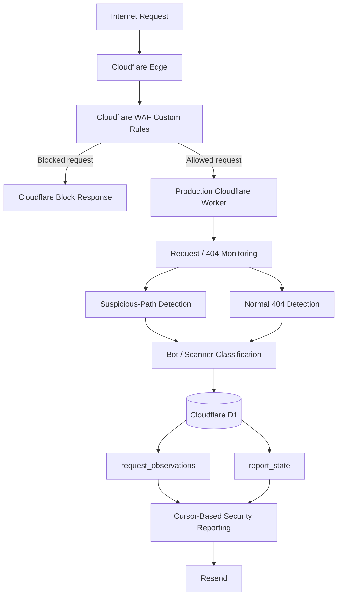

# Architecture

## Project Scope

This repository documents the security-focused portion of the production Cloudflare Worker used by **CamCareer**.

The security system operates as part of the same production Worker that also supports the separate visitor-reporting project. This repository focuses on:

- Cloudflare WAF custom rules
- Server-side security-request monitoring
- 404 and suspicious-path detection
- Bot/scanner classification
- Cloudflare D1 security logging
- Cursor-based security reporting
- Analysis of real-world scanner traffic

The repository should not be interpreted as a second independently deployed Worker.

## Production Flow



## Main Components

### Cloudflare WAF

Cloudflare WAF custom rules provide the blocking layer for requests that are clearly inappropriate for the static CamCareer site.

Examples include:

- WordPress scanner paths
- Environment/secret-file probes
- Repository metadata probes
- PHP scanner probes

The WAF exists separately from the Worker.

### Production Cloudflare Worker

The Worker provides the monitoring and detection layer. It observes security-relevant requests that reach the Worker and records selected information in D1.

The Worker intentionally does not log every CSS, image, JavaScript, or other asset request.

### Cloudflare D1

The current production database is:

```text
camcareer-security-logs
```

Worker binding:

```text
SECURITY_DB
```

The security-focused table is:

```text
request_observations
```

The reporting cursor table is:

```text
report_state
```

### Resend

Security information is included in automated email reports. Reports run on the existing four-hour schedule and can also be triggered manually.

The database rows are not deleted after a successful report. Instead, the report cursor advances.

## Shared Production Worker

The production Worker is:

```text
website-visitor-tracker
```

Cloudflare routes:

```text
camcareer.com/*
*.camcareer.com/*
```

Cron schedule:

```text
0 */4 * * *
```

The security and visitor-reporting features currently share this Worker, but they are documented as two related portfolio projects because they solve different problems.

## Storage Architecture

The current production system is D1-only.

The former Workers KV binding:

```text
VISITOR_LOGS
```

has been removed from the Worker.

The old KV namespace may remain temporarily as a disconnected rollback backup, but the production Worker should not use it.

## Security Boundary

The Worker is not the entire firewall.

The accurate description is:

> Cloudflare WAF custom rules + a Worker-based monitoring and detection layer.

Blocking decisions and classification decisions are intentionally separate.
